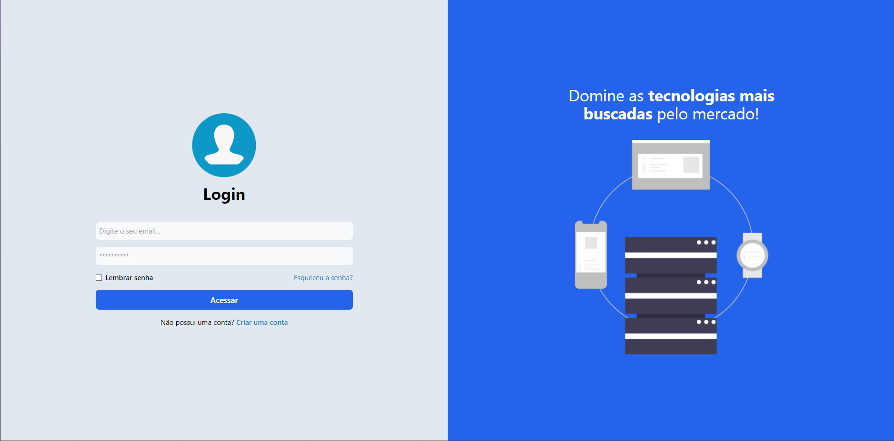
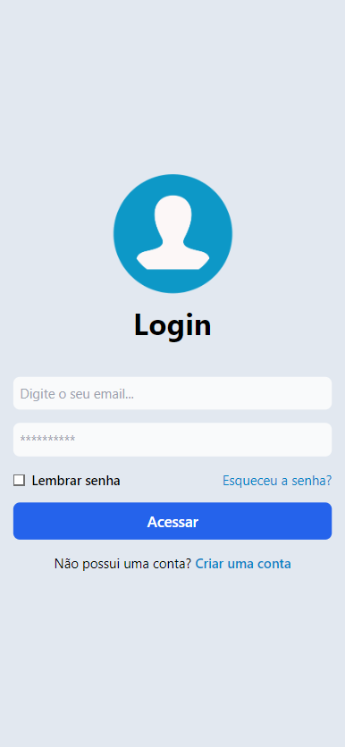

<h1 align="center"> 
    Tela Login | Praticando Tailwind 🚀
</h1>

    

        <h4>Desktop</h4>
        
    

    

        <h4>Mobile</h4>
        
    

## 💻 Sobre o projeto

Projeto simples de página de login para praticar tailwind, utilizando como base para estudo e documentação no Notion. Esse é o primeiro projeto de uma série de outros projetos 
utilizando Tailwind através do curso do @MatheusFraga na plataforma Udemy. 

Posterior a essa série de projetos, será desenvolvido um pequeno projeto autoral utilizando Tailwind.

---

## 💻 Tecnologias utilizadas 

- HTML.
- Tailwind.

---

## ⚙️ Documentação do aprendizado e geração de perguntas

---

## 📝 Licença

Este projeto esta sobe a licença [MIT](./LICENSE).

Feito por Jessica Monique (pode chamar de Monique 👋🏽) | 
[Linkedin](https://www.linkedin.com/in/jmoniquemelo/)
